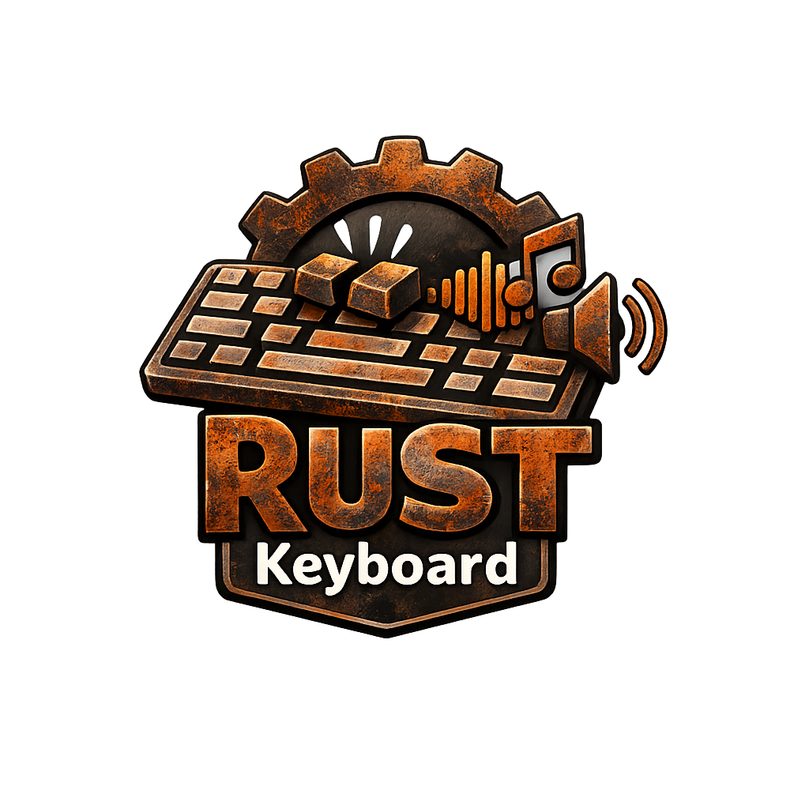

<p align="center">
  
</p>

# rust-keyboard

`rust-keyboard` is an Arch Linux keyboard sound utility built in Rust. It runs as a tray-first desktop app, listens to Linux input events through `evdev`, and plays synthesized key sounds with live profile and volume control.

Version: `1.0.1`

## Features

- tray-first app flow: `cargo run` starts the app directly
- Wayland-friendly input capture through `/dev/input/event*`
- synthesized sound profiles: `apple`, `android`, `blue`, `brown`, `red`
- live profile and volume changes from the tray menu
- persistent config in `~/.config/rust-keyboard/config.toml`
- diagnostic commands for input-device discovery and config inspection

## Platform Notes

This project targets Arch Linux first.

It works under Wayland by reading kernel input devices directly instead of relying on compositor-specific global key APIs. That makes it more reliable across desktop environments, but it also means the process needs permission to read `/dev/input/event*`.

This also works under X11, but X11 support is incidental rather than the design target.

## Requirements

- Arch Linux
- PipeWire or another working audio output stack
- Rust and Cargo if you are building from source
- a desktop environment with a StatusNotifierItem-compatible tray host

Install the basic packages:

```bash
sudo pacman -S base-devel pipewire rust cargo
```

To allow keyboard device access, the quickest route is:

```bash
sudo usermod -aG input "$USER"
```

Then log out and log back in.

You can use a dedicated udev rule instead if you want tighter access control.

## Usage

Run the app:

```bash
cargo run
```

Run diagnostics:

```bash
cargo run -- doctor
```

Print the effective config:

```bash
cargo run -- dump-config
```

## Configuration

Config is stored at:

```text
~/.config/rust-keyboard/config.toml
```

Default example:

```toml
[runtime]
backend = "evdev"
device_filters = []

[audio]
profile = "brown"
volume = 0.45
```

To limit the app to selected keyboards:

```toml
[runtime]
backend = "evdev"
device_filters = ["keychron", "zsa"]
```

## Profiles

- `apple`: softer laptop-style click
- `android`: short touchscreen-style tap
- `blue`: louder clicky mechanical sound
- `brown`: moderate tactile mechanical sound
- `red`: softer linear mechanical sound

## Limitations

- requires access to `/dev/input/event*`
- tray availability depends on your desktop environment exposing an SNI host
- this release uses synthesized sounds, not sampled sound packs
- no hotplug support yet for newly attached keyboards
- no overlay UI or compositor-specific effects

## Development

Check the project:

```bash
cargo check
```

Run tests:

```bash
cargo test
```
